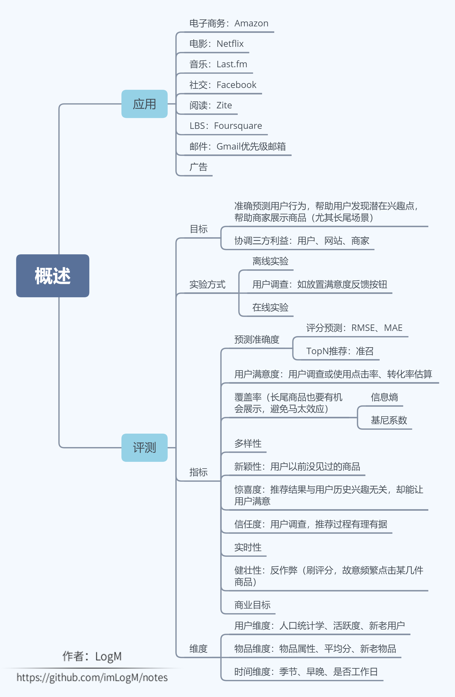
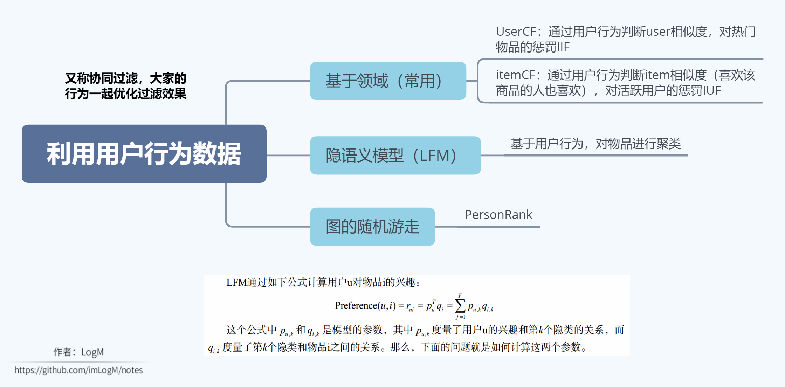
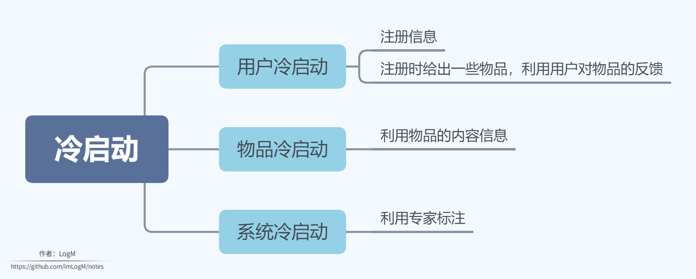
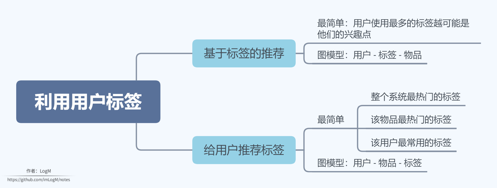
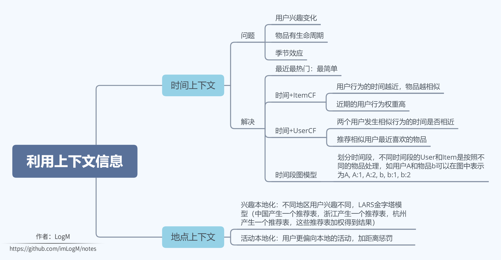
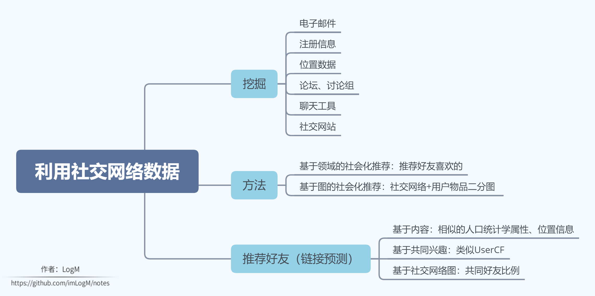

# 推荐系统实践

作者：LogM

本文原载于 [https://segmentfault.com/u/logm/articles](https://segmentfault.com/u/logm/articles)，不允许转载~

本文是 [推荐系统实践](https://book.douban.com/subject/10769749/) 的读书笔记。

## 1. 概述

## 2. 利用用户行为数据

## 3. 冷启动

## 4. 利用用户标签

## 5. 利用上下文信息

## 6. 利用社交网络数据

