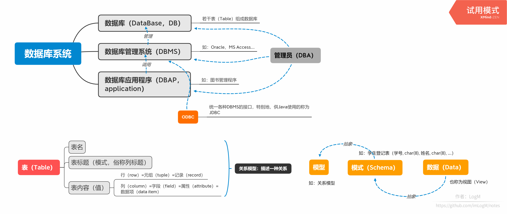
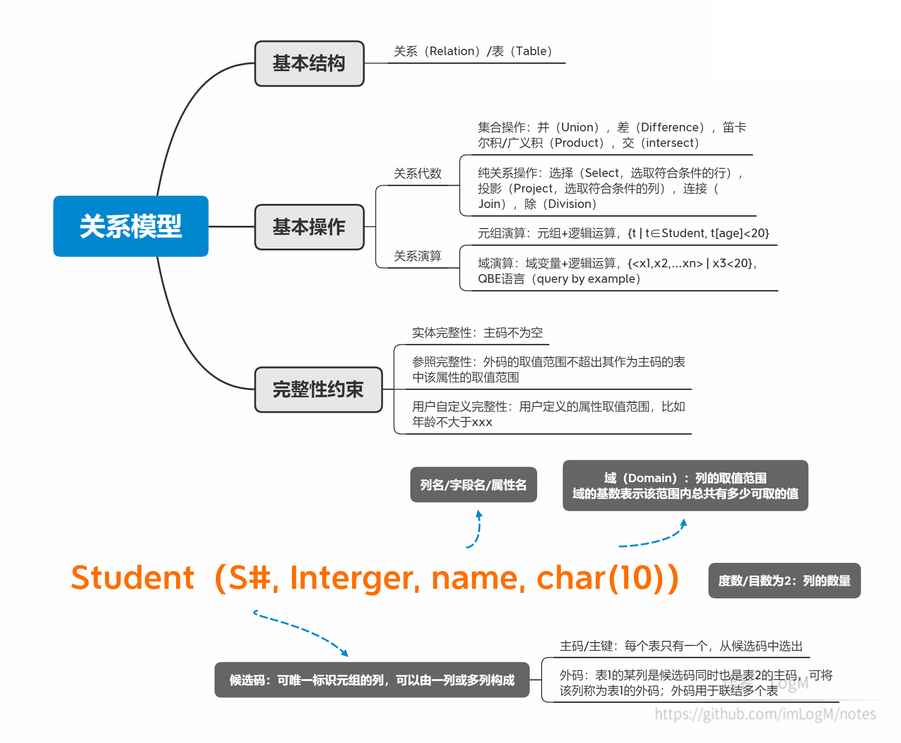
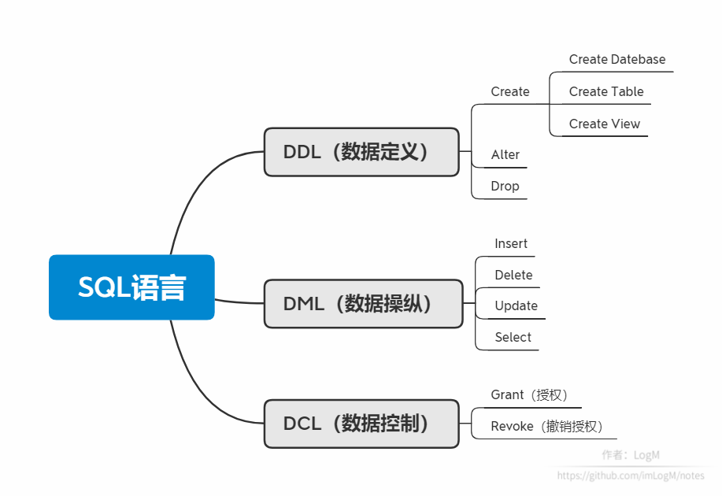

# 数据库系统：编程语言

作者：LogM

本文原载于 [https://segmentfault.com/u/logm/articles](https://segmentfault.com/u/logm/articles) ，不允许转载~

本文是 Mooc 课程 [数据库系统](https://www.icourse163.org/course/HIT-1001516002) 的笔记。

## 1. 数据库系统概述

<div align=left>

</div>

## 2. 关系模型

<div align=left>

</div>

## 3. SQL语言

<div align=left>

</div>

```sql
--创建数据库
Create Database SCT;

--创建表
Create Table Student(S# char(8) not null, Sname char(10),
                     Ssex char(2), Sage integer,
                     D# char(2), Sclass char(6));
Create Table Course(C# char(3), Cname char(12), Chours integer,
                    Credit float(1), T# char(3));

--插入
Insert Into Student
Values('98030101', '张三', '男', 20, '03', '980301');
Insert Into Student(S#, Sname, Ssex, Sage, D#, Sclass)
Values('98030102', '李四', '女', 20, '03'， '980301');

--查询
Select * From Sudent;
Select DISTINCT Sname, Sage
From Student Where Sage<=19 and D#='03';  --使用关键字DISTINCT去重

--排序
Select S#, Sname From Student
Order By S# ASC;  --ASC升序，DESC降序，默认升序

--模糊查询
--'%'匹配零个或多个字符，'-'匹配任意单个字符，'\'转移字符
Select S#, Sname From Student
Where Sname Like '张%';  --Like 或 Not Like

--多表联合查询
Select * From Student, SC, Course
Where Student.S#=SC.S# and SC.C#=Course.C# and Cname='数据库'
Order By Score DESC;
Select S1.Sname as Stud1, S2.Sname as Stud2
From Student S1, Student S2
Where S1.Sage>S2.Sage  --表的重命名
Select S1.S# From SC S1, SC S2
Where S1.S#=S2.S# and S1.C#='001' and S2.C#='002'  --查询同时学过两门课程的同学学号

--新增
--将符合条件的内容插入新表ST中
Insert Into St(S#, Sname)
Select ... From ... Where ... Order By ...;

--删除
Delet From SC;
Delet From SC Where S#='98030101';

--修改
Update Teacher Set Salary=Salary*1.05;  --所有教师的工资涨5%

--表修正
Alter Table Student Add Saddr char[40], PID char[18]; --表新增2列
Alter Table Student Modify Sname char(10);  --修改列的数据类型
Alter Table Student Drop Unique(Sname);  --Sname不再作为候选码
Alter Table Student Drop Sname;  --删除一列

--删除表/数据库
Drop Table Student;  --删除表
Drop Database SCT;  --删除数据库

--切换数据库
use SCT;  --切换到SCT数据库
close SCT;  --关闭SCT数据库
```

```sql
--(Not) In 子查询
Select * From Student Where Sname in ('张三', '李四');
Select S#, Sname From Student
Where S# not in (Select S# From SC Where C#='001');  --没学过课程001的同学

--Some/All 子查询
Select Tname From Teacher
Where Salary<=all (Select Salary From Teacher);  --工资最低的老师
Select Tname From Teacher
Where Salary<some (Select Salary From Teacher);  --工资不是最高的老师

--(Not) Exists 子查询
--判断元组是否存在
Select Sname From Student
Where not exists
      (Select * From Course, SC, Teacher
       Where Tname='李明', and Course.T#=Teacher.T#
       and Course.C#=SC.C# and S#=Student.S#);  --没有学过李明老师任何一门课的学生姓名

--结果计算
Select T1.Tname as Tr1, T2.Tname as Tr2, T1.Salary-T2.Salary as diff
From Teacher T1, Teacher T2
Where T1.Salary>T2.Salary;

--聚集函数
--Count, Sum, Avg, Max, Min
Select Sum(Salary) From Teacher;  --求教师工资总和

--聚集
Select S#, Avg(Score) From SC Group By S#;  --求每个学生的平均成绩

--分组过滤
Select S# From SC
Where Score<60
Group By S# Having Count(*)>2;  --不及格课程超过2门的学生学号

--并交差
--Union并、Intersect交、Except差
--带All则保留重复
Select S# From SC Where C#='002'
UNION
Select S# From SC Where C#='003';   --学过课程002或课程003的同学

--空值处理
Select Sname From Student
Where Sage is null;  --找出年龄为空的学生姓名

--连接
--[inner | {left|right|full} outer] join
--on ... 条件连接；natural 自然连接
Select Teacher.T#, Tname, Cname
From Teacher Inner Join Course
     ON Teacher.T#=Course.T#
Order By Teacher.T# ASC;  --求所有教师的任课情况

--视图 View
Create View CompStud AS
       (Select * From Student
        Where D# in (Select D# From Dept Where Dname='计算机'))  --计算机系的学生定义为一个视图
Create View StudStat(S#, Sname, AvgS, CNT)
AS (Select S#, Sname, Avg(Score), Count(*))
    From Student S, SC
    Where S.S#=SC.S#
    Group By S.S#);  --将学生的平均成绩定义为视图
--定义好的视图可以像Table一样操作
Drop View CompStud;  --删除视图
```

```sql
--约束
--列约束
Create Table Student(S# char(8) not null unique,  --不能为空，且是候选码
                     Sname char(10),
                     Ssex char(2) constraint ctssex check (Ssex='男' or Ssex='女'),  --定义性别约束，并取名ctssex
                     Sage integer check(Sage>=1 and Sage<150)  --定义年龄约束
                     D# char(2) references Dept(D#) on delete cascade,
                     --定义外码，并设置删除时其它表对应行也删除(cascade)，也可以设为置空（set null）
                     Sclass char(6));

--表约束
Create Table Student(S# char(8), ...,
                     primary key(S#),   --定义主码
                     constraint xxx check(xxxx)  --定义表约束，可涉及多列，并命名为xxx
                     foreign key(S#) references Course(S#) on delete cascade,
                     foreign key(D#) references Dept(D#) on delete cascade
                     --定义外码，并设置删除时其它表对应行也删除(cascade)，也可以设为置空（set null）
                     );

--断言：对任何更新都执行所有断言，慢
Create Assertion ctssex Check
(not exists(
            Select * From Student
            Where Ssex<>'男' and Ssex<>'女'
));

--触发器
Create Trigger teacher_chgsal
Before Update of Salary On Teacher
Referencing new x, old y
for each row when (x.Salary<y.Salary)
begin
    raise_application_error(-20003, 'invalid salary on update');
end;  --设定教师的工资只能涨不能降，并取名为teacher_chgsal

Create Trigger updS#
After Update of S# On Student
Referencing old oldi, new newi
for each row
begin
    update SC set S#=newi.S# where S#=oldi.S#;
end;  --当学生的学号更换时，SC表中的学号自动更换
```

```sql
--授权
Grant All Priviledges On Employee To Emp2001;  --该员工拥有Employee表的所有权限
Grant SELECT On EmpV2 To Emp5001;  --该员工拥有EmpV2视图的读取权限
Grant SELECT On EmpV3 To public;  --所有员工拥有EmpV2视图的读取权限

--撤销授权
Revoke All Priviledges On Employee From Emp2001;
```

## 4. 嵌入式SQL

```sql
--变量声明
exec sql begin declare section;
    char vSname[10], vSpecName[10]='张三';
    int vSage;
exec sql end declare section;

--数据库连接
exec sql connect to target-server as connect-name user user-name;  --标准写法
exec sql connect to default;  --或这样写

--数据库断开
exec sql disconnect connect-name;  --标准写法
exec sql disconnect current;  --或这样写

--单条记录处理：c语言中的使用
exec sql select Sname, Sage into :vSname, :vSage from Student
where Sname=:vSpecName;  --可以在最后加 for read only

--提交与撤销
--只有当执行到提交时sql才正式执行
--视为一次"事务"
exec sql commit work;  --提交
exec sql rollback work;  --撤销

--多条记录处理：游标
--定义游标
exec sql declare cur_student cursor for
select Sno, Sname, Sclass from Student
where Sclass='035101';   --可以在最后加 for read only
--打开游标
exec sql open cur_student;
--依次读入
while(1) {
    exec sql fetch cur_student into :vSno, :vSname, :vSclass;
}
--关闭游标
exec sql close cur_student;
--可滚动的游标（ODBC支持）
--不只限于从上到下读
exec sql declare cursor_name scroll for xxx;
exeec sql fetch [next|prior|first|last|absolut xx|relative xx] from cursor_name into xxx;

--删除
exec sql delete from Student S where S.Sname='张三';
while(1) {
    exec sql fetch cursor_name into xxx;
    exec sql delete from Student where current of cursor_name;
}

--异常捕获
--异常类型：sqlerror、not found、sqlwarning
--可选择的处理方式：continue、goto、stop、do/call
exec sql include sqlca;  --SQL communication area 头文件
exec sql whenever sqlerror goto report_error;
report_error:
    exec sql rollback;
```