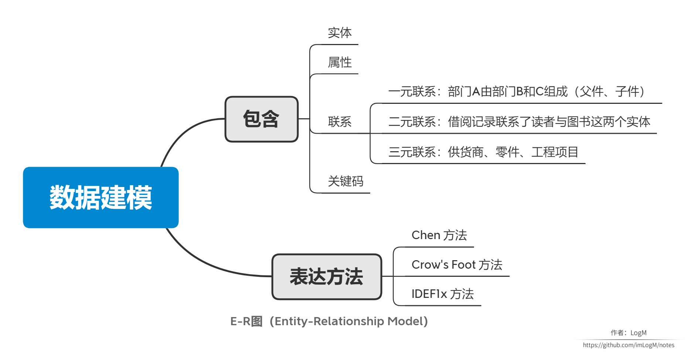
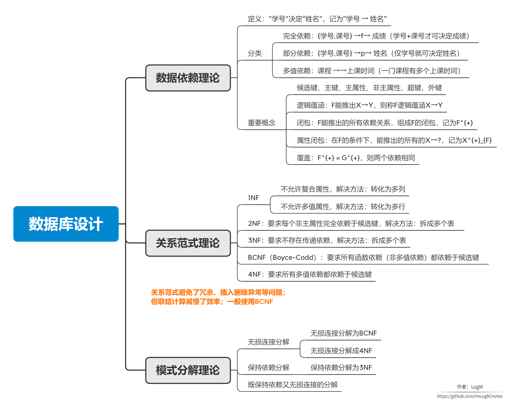

# 数据库系统：建模与设计

作者：LogM

本文原载于 [https://segmentfault.com/u/logm/articles](https://segmentfault.com/u/logm/articles) ，不允许转载~

本文是 Mooc 课程 [数据库系统](https://www.icourse163.org/course/HIT-1001554030) 的笔记。

## 1. 概述

## 2. 数据建模

## 3. 数据库设计

